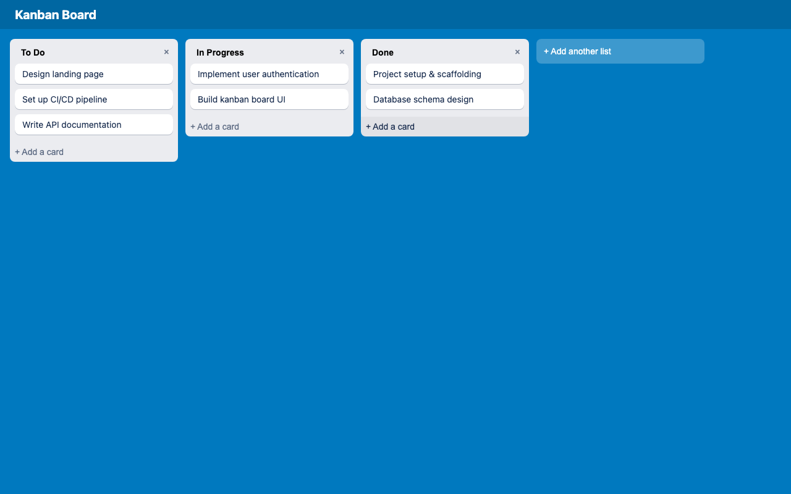
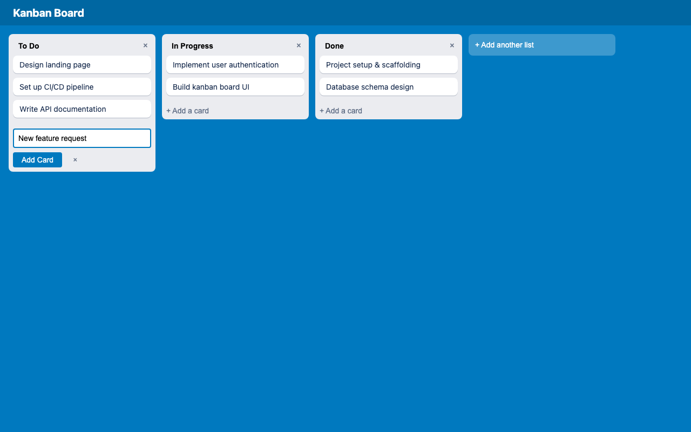
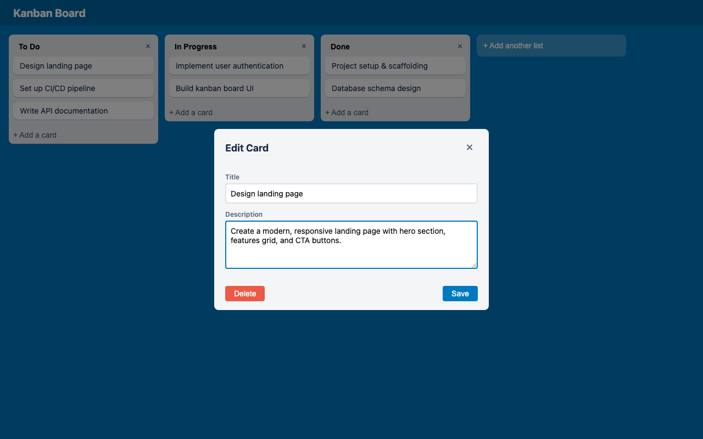

# Trello App

A Trello-like kanban board web app built with Node.js, Express, and SQLite.

## Features

- Drag-and-drop cards between columns
- Add, edit, and delete cards with title and description
- Add and delete lists (columns)
- Persistent storage via SQLite
- Seeded with three default columns: **To Do**, **In Progress**, **Done**

## Screenshots

### Board with cards


### Add card form


### Edit card modal


### Drag and drop


## Requirements

- Node.js 18+

## Setup

```bash
cd trello-app
npm install
```

## Running

```bash
npm start
```

Open [http://localhost:3000](http://localhost:3000) in your browser.

Set a custom port with the `PORT` environment variable:

```bash
PORT=4000 npm start
```

## Testing

Playwright end-to-end tests:

```bash
npm test
```

Tests run against `http://localhost:3000`. Make sure the server is not already running on that port before running tests — Playwright starts its own server via `webServer` in `playwright.config.js`.

## API Reference

### Lists

| Method | Endpoint | Body | Description |
|--------|----------|------|-------------|
| `GET` | `/api/lists` | — | Get all lists with nested cards |
| `POST` | `/api/lists` | `{ title }` | Create a list |
| `PUT` | `/api/lists/:id` | `{ title }` | Rename a list |
| `DELETE` | `/api/lists/:id` | — | Delete a list and its cards |

### Cards

| Method | Endpoint | Body | Description |
|--------|----------|------|-------------|
| `POST` | `/api/cards` | `{ title, description, list_id }` | Create a card |
| `PUT` | `/api/cards/:id` | `{ title?, description?, list_id?, position? }` | Update a card (supports moving between lists) |
| `DELETE` | `/api/cards/:id` | — | Delete a card |

## Project Structure

```
trello-app/
├── server.js          # Express app and route handlers
├── db.js              # SQLite database setup and queries
├── playwright.config.js
├── public/
│   ├── index.html     # Board UI
│   ├── style.css      # Styles
│   └── app.js         # Frontend logic and drag-and-drop
└── tests/             # Playwright e2e tests
```
